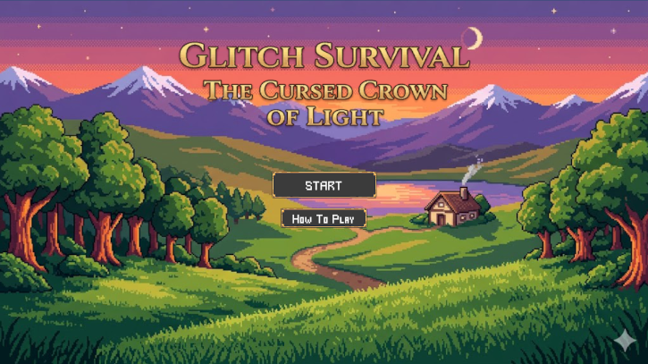
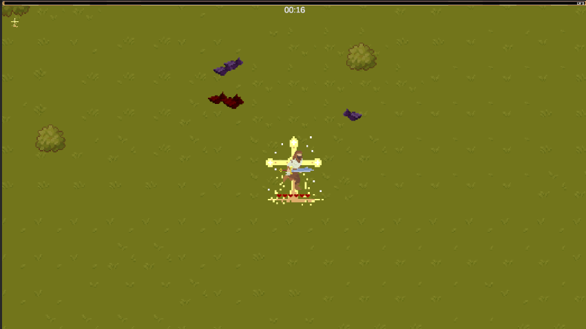
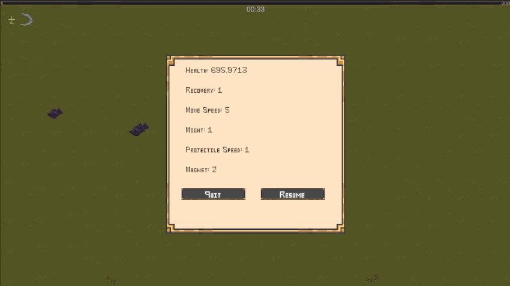
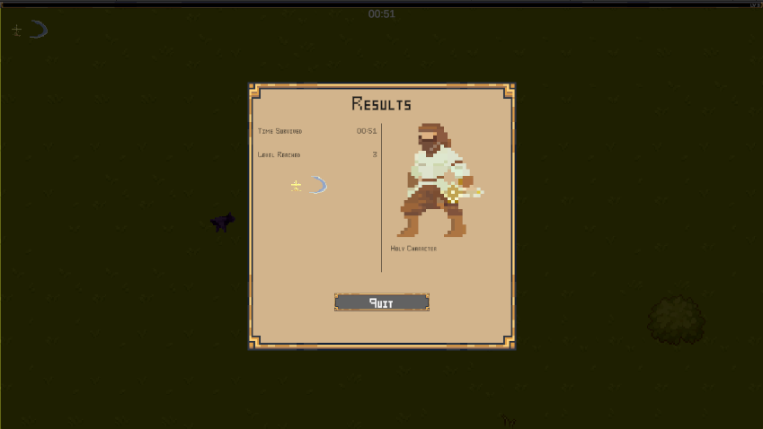
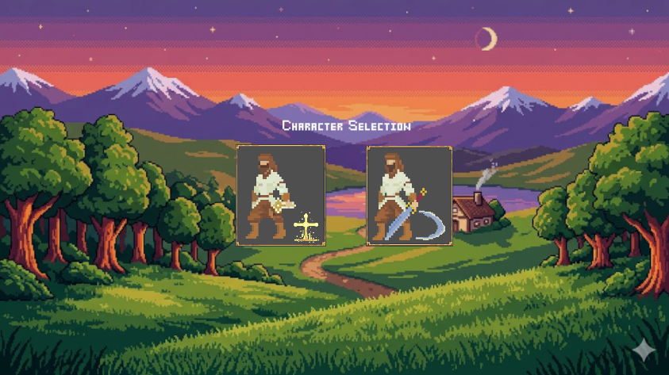
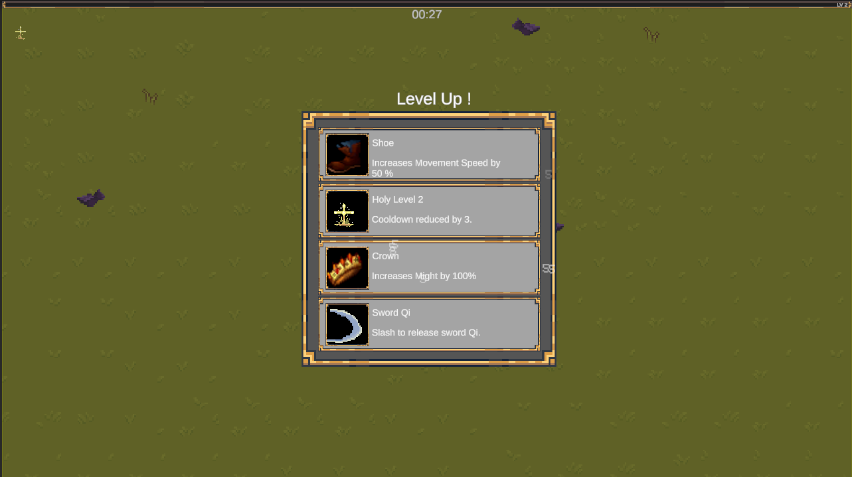

# Glitch Survival



A **Vampire Survivors**-style prototype built in Unity, focused on enemy spawning and the level-up upgrade loop. This is a personal learning project created to sharpen game-development skills and explore internship opportunities.

## Playing the Game

### Controls

- **Arrow Keys:** Move the character
- **Mouse:** Choose your upgrade at each level up

### Gameplay Overview

Survive as long as possible by avoiding and defeating waves of enemies. Collect power-ups to enhance your character's abilities. Each game session lasts until your character's health depletes.






## Development

### Project Structure

```
Assets/_GlitchSurvival/
├── Animations/       # In-game animations
├── Prefabs/          # Enemy, weapon, and pickup prefabs
├── Scenes/           # Unity scenes (title, menus, and main game)
├── Scripts/          # Game logic scripts
└── ScriptableObject/ # Data assets for characters, enemies, weapons, and upgrades
```




**ScriptableObject:** Reusable data assets that store stats and configuration (e.g. character stats, enemy health, weapon damage) outside of scene objects, making gameplay values easy to tune in the Unity Editor without changing code.

## Contact

- **LinkedIn:** [thanh-nguyen-ba](https://www.linkedin.com/in/thanh-nguyen-ba-17139325a)
- **LinkedIn:** [GlitchSurvival GamePlay](https://youtu.be/hPd1-7PQ7vI)